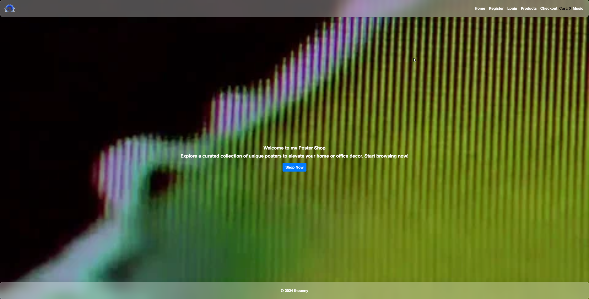
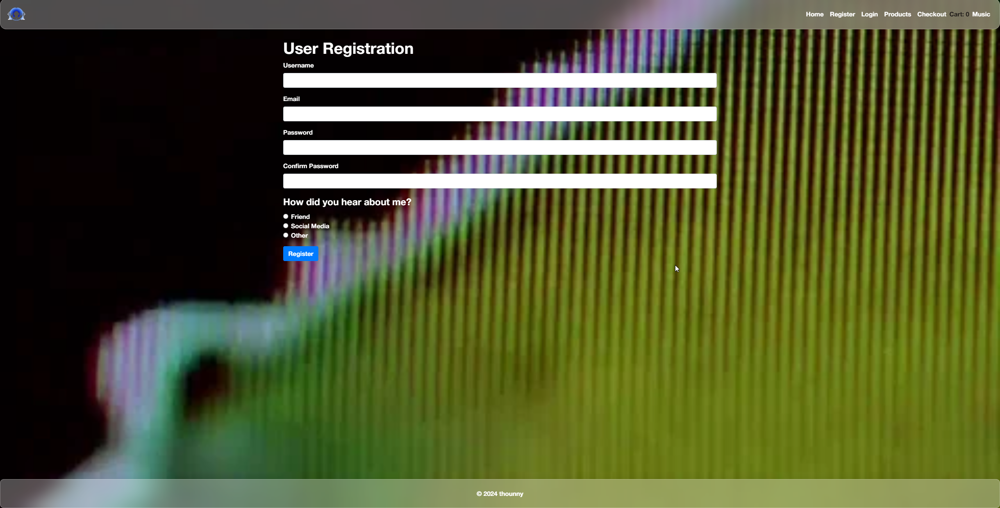
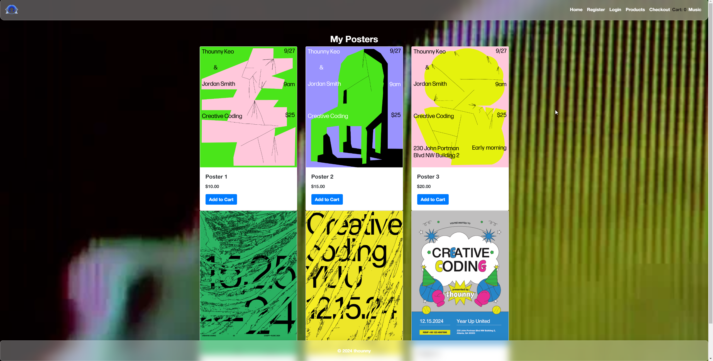
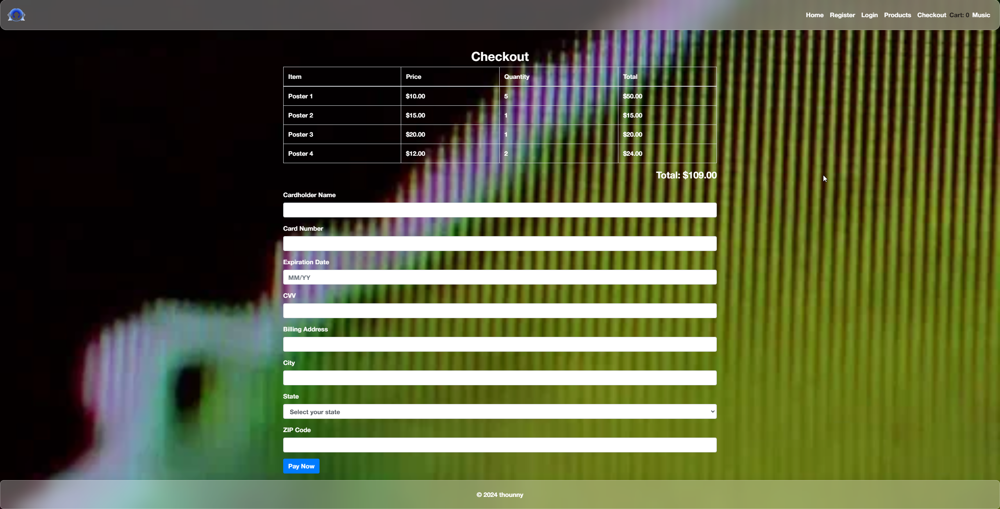
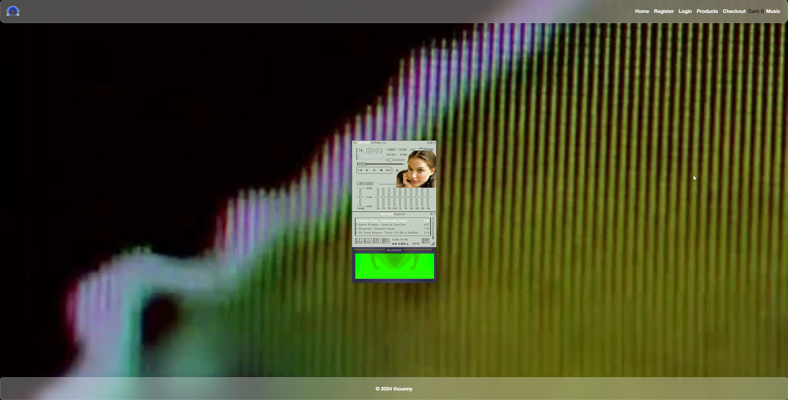

# E-Commerce Poster Shop 

Welcome to my **E-Commerce Poster Shop**! This capstone project for my Frontend Development class at Year Up United showcases original posters designed by me and integrates a personalized music experience through the Webamp player with a visualizer.

## 🛠️ Tools & Technologies

- **HTML5**, **CSS3**, **JavaScript**: Used for the structure, styling, and functionality of the website.
- **Bootstrap**: Ensures a modern, responsive design across devices.
- **Webamp**: A web-based Winamp emulator integrated for a nostalgic, music-driven experience, with the Milkdrop visualizer and custom skins.
- **jQuery & Popper.js**: Supports interactive components within Bootstrap.

### Webamp Player

The Webamp player is fully responsive and features:
- **Milkdrop Visualizer** for an immersive visual experience.
- **Custom Skins**: 
  - *Nat Amp*
  - *X Hinoto*
  - *Serial Experiments Lain*
  - *Love Hina*
- **Music Tracks**:
  - *Pandora (for Cindy)* by Cocteau Twins
  - *Never In Your Sun* by Stevie Wonder
  - *Summer's Gone* by Honeydip
  - *Victor, Fly Me to Stafford* by My Little Airport

### Scripts & Libraries

- **Webamp**: [Webamp Library](https://unpkg.com/webamp@1.5.0/built/webamp.bundle.min.js) for the music player.
- **Butterchurn & Presets**: [Butterchurn](https://unpkg.com/butterchurn@2.6.7/lib/butterchurn.min.js) and [Butterchurn Presets](https://unpkg.com/butterchurn-presets@2.4.7/lib/butterchurnPresets.min.js) for the visualizer.
- **Bootstrap**: [Bootstrap](https://stackpath.bootstrapcdn.com/bootstrap/4.5.2/css/bootstrap.min.css) for layout and components.

## 💻 How to Run the Project

1. Clone the repository: `git clone https://github.com/thounny/E-Commerce-Poster-Shop.git`
2. Open `index.html` in your browser to view the site.
3. The Webamp player and visualizer will automatically load on the "Music" page.

## 🖼️ Poster Designs

All posters featured in the shop are original creations that reflect my artistic vision and design style, spanning various themes.

## 🌐 Website Previews

Here are some previews of the website pages:

### Homepage


### Register Page


### Login Page


### Products Page


### Checkout Page



### Music Page


## 🏗️ Project Structure

```bash
.
├── checkout.html         # Checkout page
├── index.html            # Homepage with product listings
├── login.html            # Login page
├── music.html            # Music page with Webamp player
├── products.html         # Page displaying all posters
├── register.html         # Registration page
├── css/
│   └── styles.css        # Main stylesheet
├── fonts/
│   └── helveticaneue.woff2  # Custom font
├── images/
│   ├── gradient.gif      # Background gradient image
│   ├── logo.png          # Logo for the website
│   └── posters/          # Folder containing all poster images
│       ├── 1.png
│       ├── 2.png
│       ├── 3.png
│       ├── 4.png
│       ├── 5.png
│       └── 6.png
├── songs/
│   ├── Honeydip - Summer's Gone.mp3
│   ├── My Little Airport - Victor, Fly Me to Stafford [HQ].mp3
│   ├── Never In Your Sun.mp3
│   └── Pandora (for Cindy).mp3
└── webamp-skins/
    ├── Love_Hina_v1_9.wsz
    ├── Nat-Amp_v01.wsz
    ├── Neon_Utada_hikaru_skin.wsz
    ├── Serial Experiments Lain - You Don't Understand.wsz
    └── X_-_Hinoto.wsz
```

## 🎵 Music Credits

- **Pandora (for Cindy)** - Cocteau Twins
- **Never In Your Sun** - Stevie Wonder
- **Summer's Gone** - Honeydip
- **Victor, Fly Me to Stafford** - My Little Airport

## 🏆 Credits

- **Webamp**: [Webamp](https://github.com/captbaritone/webamp) for the player functionality.
- **Butterchurn**: [Butterchurn](https://github.com/jberg/butterchurn) for the visualizer and presets.
- **Skins**: Thanks to the creators of the custom skins used in this project.

## 🎓 About the Project

This project is the culmination of my learnings at Year Up United’s Frontend Development program. It combines everything from **HTML/CSS**, **Bootstrap**, and incorporates advanced features like the Webamp player for enhanced user interaction.

---
## Author


**Thounny Keo**  
Frontend Development Student | Year Up United
